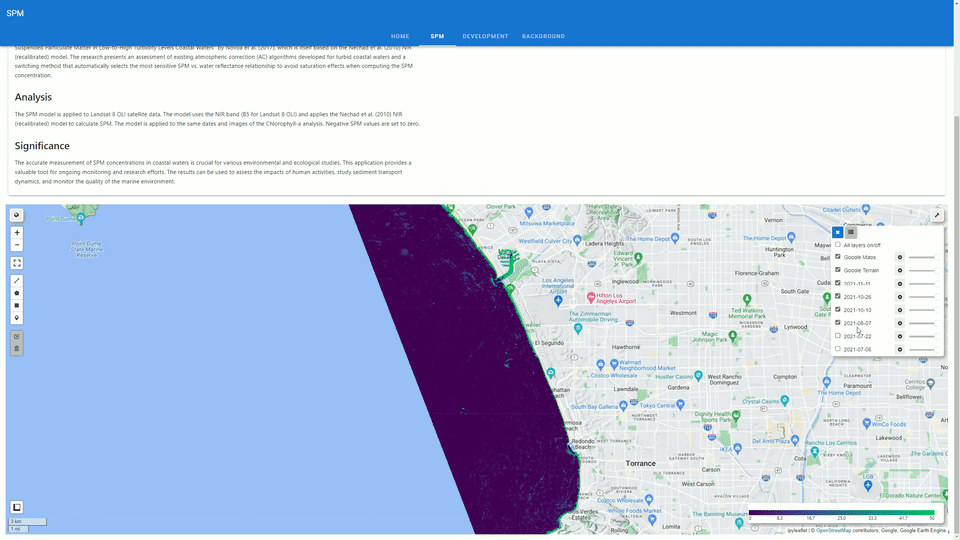

# WaterQualityMonitoring_using-GEE

# Earth Engine App

A collection of [Earth Engine web apps](https://romero61-waterqualitymonitoring-smb.hf.space) developed using Solara and geemap.

# WaterQualityMonitoring_SMB
Monitoring water quality in the Santa Monica Bay using Landsat 8 OLI satellite data

# Reproducing Chlorophyll-a Analysis in Santa Monica Bay Using Landsat 8
This notebook aims to reproduce and extend the analysis conducted in the ocean remote sensing project titled "Remote Sensing of Chlorophyll-a using Landsat 8". The original project, available  [here](https://romero61.github.io/posts/SMB/), focused on the analysis of Chlorophyll-a concentrations in the Santa Monica Bay.

We utilize Landsat 8 satellite imagery to estimate Chlorophyll-a concentrations & Suspended Particle Matter and analyze changes over time, particularly focusing on the impact of the Hyperion Treatment Plant failure.

The notebooks include the following steps:

1. Importing necessary Python libraries for data manipulation, mathematical operations, data visualization, handling date and time data, interacting with Google Earth Engine, and handling geospatial data.

2. Initializing the Earth Engine API and creating an interactive map using the geemap library.

3. Defining the collection of satellite images to be used (Landsat 8 OLI images) and the study area.

4. Processing the satellite images, including applying scale factors and estimating Chlorophyll-a & Suspended Particle Matter concentrations.

5. Visualizing the processed images on an interactive map.

The next steps of this project will include retrieving the most recent image from the collection, calculating basic statistics for Chlorophyll-a concentrations & Suspended Particle Matter, allowing user-defined regions for analysis, and creating an interactive data exploration.

# Santa Monica Bay

Santa Monica Bay Watershed Management Area (WMA): The Santa Monica Bay WMA encompasses an area of 414 square miles and is quite diverse. Its borders reach from the crest of the Santa Monica Mountains on the north and from the Ventura-Los Angeles County line to downtown Los Angeles. The WMA includes several watersheds, the two largest being Malibu Creek to the north (west) and Ballona Creek to the south. The Malibu Creek area contains mostly undeveloped mountain areas, large acreage residential properties, and many natural stream reaches. At the same time, Ballona Creek is predominantly channelized and highly developed with both residential and commercial properties. The Santa Monica Bay was included in the National Estuary Program in 1989 and has been extensively studied by the Santa Monica Bay Restoration Project. The Santa Monica Bay Watershed Commission was established in 2002 to oversee the implementation of the Plan.

Water Quality Problems and Issues: The Santa Monica Bay WMA embraces a high diversity of geological and hydrological characteristics, habitat features, and human activities. Existing and potential beneficial use impairment problems in the watershed fall into two major categories: human health risk and natural habitat degradation. The former are issues primarily associated with recreational uses of the Santa Monica Bay. The latter are issues associated with terrestrial, aquatic, and marine environments. Pollutant loadings that originate from human activities are common causes of both human health risks and habitat degradation.

# Suspended Particulate Matter 

The Santa Monica Bay, California, and the Gironde Estuary and Bourgneuf Bay in France have some similarities but also significant differences. Here are some key points to consider:

Size and Geography: The Santa Monica Bay is a bight of the Pacific Ocean, while the Gironde Estuary and Bourgneuf Bay are estuaries, which are partially enclosed coastal bodies of water where freshwater from rivers and streams meets and mixes with saltwater from the ocean. The Gironde Estuary is formed by the confluence of the Garonne and Dordogne Rivers, and the Loire River feeds into Bourgneuf Bay. The Santa Monica Bay, on the other hand, is fed by several smaller watersheds, including Malibu Creek and Ballona Creek.

Turbidity and SPM Concentration: The Gironde Estuary and Bourgneuf Bay are characterized by high Suspended Particulate Matter (SPM) concentrations, ranging from 1 to 3000 g·m−3 in the Gironde and 50 to over 1000 g·m−3 in Bourgneuf Bay. The Santa Monica Bay, according to the information found, has a lower SPM concentration, with a median value of 1.3 mg/L (or approximately 0.0013 g·m−3), which is significantly lower than the French sites.

Tidal Range: Both the Gironde Estuary and Bourgneuf Bay have a macro-tidal regime, with tidal ranges from 2 to 5 m and 2 to 6 m, respectively. The tidal range in the Santa Monica Bay is not explicitly stated in the sources found, but the Pacific coast of Southern California typically experiences a smaller tidal range, usually less than 2 meters.

Freshwater Inputs: The Gironde Estuary and Bourgneuf Bay have significant freshwater inputs from large rivers, with flow rates ranging from less than 100 m3·s−1 to more than 4000 m3·s−1. The Santa Monica Bay receives freshwater inputs from several smaller watersheds, but the flow rates are likely much lower than those of the French sites.

The Santa Monica Bay, California, and the Gironde Estuary and Bourgneuf Bay in France have some similarities but also significant differences. Here are some key points to consider:

Size and Geography: The Santa Monica Bay is a bight of the Pacific Ocean, while the Gironde Estuary and Bourgneuf Bay are estuaries, which are partially enclosed coastal bodies of water where freshwater from rivers and streams meets and mixes with saltwater from the ocean. The Gironde Estuary is formed by the confluence of the Garonne and Dordogne rivers, and the Loire River feeds into Bourgneuf Bay. The Santa Monica Bay, on the other hand, is fed by several smaller watersheds, including Malibu Creek and Ballona Creek.

Turbidity and SPM Concentration: The Gironde Estuary and Bourgneuf Bay are characterized by high Suspended Particulate Matter (SPM) concentrations, ranging from 1 to 3000 g·m−3 in the Gironde and 50 to over 1000 g·m−3 in Bourgneuf Bay. The Santa Monica Bay, according to the information found, has a lower SPM concentration, with a median value of 1.3 mg/L (or approximately 0.0013 g·m−3), which is significantly lower than the French sites.

Tidal Range: Both the Gironde Estuary and Bourgneuf Bay have a macro-tidal regime, with tidal ranges from 2 to 5 m and 2 to 6 m, respectively. The tidal range in the Santa Monica Bay is not explicitly stated in the sources found, but the Pacific coast of Southern California typically experiences a smaller tidal range, usually less than 2 meters.

In conclusion, while there are some similarities in terms of being coastal water bodies with freshwater inputs, the Gironde Estuary and Bourgneuf Bay in France appear to be significantly more turbid and have higher SPM concentrations than the Santa Monica Bay. 

Freshwater Inputs: The Gironde Estuary and Bourgneuf Bay have significant freshwater inputs from large rivers, with flow rates ranging from less than 100 m3·s−1 to more than 4000 m3·s−1. The Santa Monica Bay receives freshwater inputs from several smaller watersheds, but the flow rates are likely much lower than those of the French sites.

In conclusion, while there are some similarities in terms of being coastal water bodies with freshwater inputs, the Gironde Estuary and Bourgneuf Bay in France appear to be significantly more turbid and have higher SPM concentrations than the Santa Monica Bay. Therefore, the models developed for the French sites may not be directly applicable to the Santa Monica Bay without some adjustments or recalibrations.

# References
Trinh, R. C., Fichot, C. G., Gierach, M. M., Holt, B., Malakar, N. K., Hulley, G., & Smith, J. (2017). Application of Landsat 8 for Monitoring Impacts of Wastewater Discharge on Coastal Water Quality. Frontiers in Marine Science, 4. https://doi.org/10.3389/fmars.2017.00329

Novoa S, Doxaran D, Ody A, Vanhellemont Q, Lafon V, Lubac B, Gernez P. Atmospheric Corrections and Multi-Conditional Algorithm for Multi-Sensor Remote Sensing of Suspended Particulate Matter in Low-to-High Turbidity Levels Coastal Waters. Remote Sensing. 2017; 9(1):61. https://doi.org/10.3390/rs9010061
